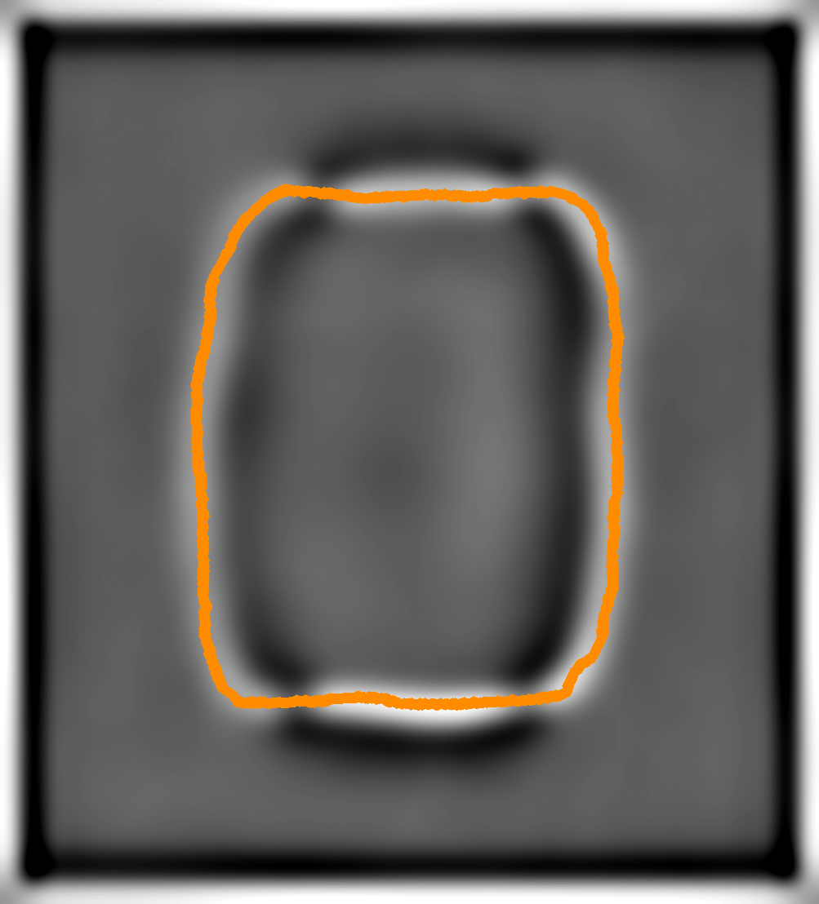
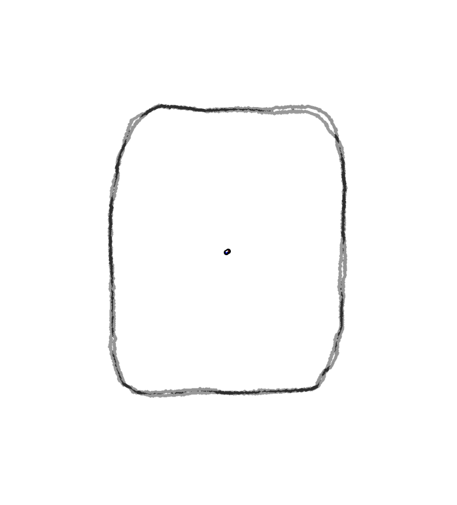
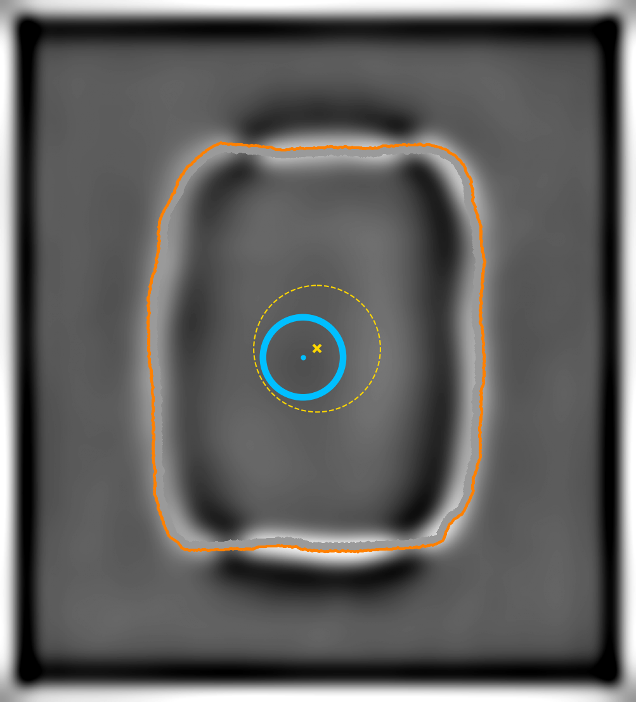
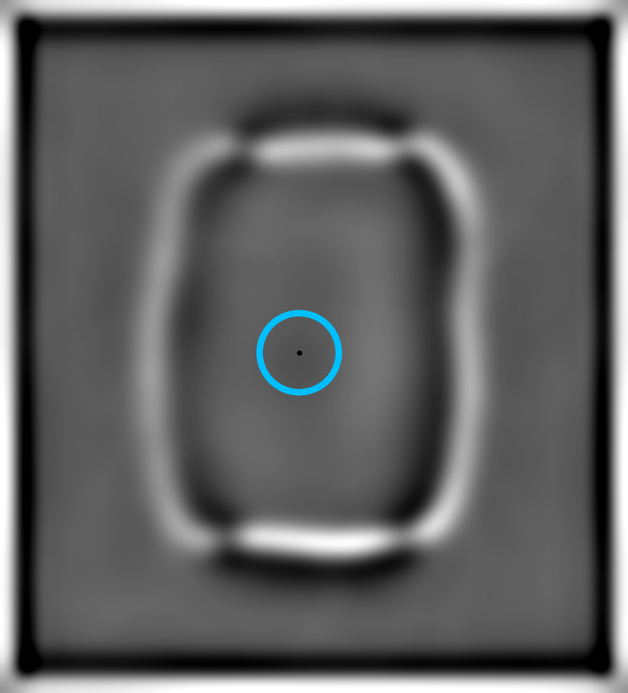

# UEM Workflow

This repository contains a cleaned Python workflow for processing image-based ultrafast electron microscopy (UEM) data and extracting motion descriptors from fitted contours and dark spot positions. The scripts are organized as numbered steps in `UEM workflow/` and are intended to be run in order.

The workflow uses a shared path configuration file, avoids hard-coded local machine paths, and writes derived results under the configured data folder.

Repository link: <https://github.com/Leeovo-zl/UEM-workflow>

## Repository Layout

```text
UEM-workflow/
  README.md
  demo/
    T0.png ... T7.png
  docs/
    figures/
      annotated_spots_dark_thick.png
      centroid_overlay_T1.png
      overlay_curve_on_gray_color_thick.png
      spots_on_external_gray_dark_thick.png
  UEM workflow/
    workflow_paths.py
    1_image_enhance_full.py
    2_extract_centralline_smooth.py
    3_mask.py
    4_fit_sketch_full.py
    5_overlay.py
    6_centroid_displacement.py
    7_black_spot_detector.py
    8_fft_bandpass_filter_Pchirality.py
```

The `demo/` folder contains a small simulated image sequence covering one period of the motion. The `docs/figures/` folder contains four representative visual outputs used by this README. Other generated outputs are created by the scripts and are not tracked in the repository.

## System Requirements

### Operating System

The workflow has been tested on:

- Windows 11, 64-bit

The scripts use standard Python libraries and should also run on macOS or Linux after adapting the shell commands and paths.

### Python and Dependencies

Tested Python version:

- Python 3.13.5

Tested package versions:

- `numpy==2.2.6`
- `pandas==3.0.2`
- `scipy==1.16.1`
- `scikit-image==0.25.2`
- `matplotlib==3.10.6`
- `imageio==2.37.0`
- `Pillow==11.3.0`

No non-standard hardware is required. The workflow runs on CPU and does not require a GPU.

## Installation

Clone the repository:

```powershell
git clone https://github.com/Leeovo-zl/UEM-workflow.git
cd UEM-workflow
```

Create and activate a Python environment:

```powershell
python -m venv .venv
.\.venv\Scripts\Activate.ps1
python -m pip install --upgrade pip
```

Install the required packages:

```powershell
python -m pip install numpy pandas scipy scikit-image matplotlib imageio pillow
```

Typical installation time on a normal desktop computer with an internet connection is approximately 5-10 minutes.

## Path Configuration

All scripts use `workflow_paths.py` for shared input and output locations. By default, the workflow expects raw data under:

```text
UEM workflow/data/raw
```

For real runs or for the demo dataset, set the environment variable `TEM_RAW_ROOT` to the folder that contains the image frames. Relative paths are resolved from the script directory.

Example from PowerShell:

```powershell
cd "UEM workflow"
$env:TEM_RAW_ROOT = (Resolve-Path "..\demo").Path
```

Derived outputs are written under the configured raw-data root, mainly in the `displacement/` subfolder.

## Demo

The `demo/` folder provides eight simulated PNG images named `T0.png` through `T7.png`. To run the complete workflow on the demo dataset, start from the `UEM workflow/` folder and execute:

```powershell
$env:TEM_RAW_ROOT = (Resolve-Path "..\demo").Path

python 1_image_enhance_full.py
python 2_extract_centralline_smooth.py
python 3_mask.py
python 4_fit_sketch_full.py
python 5_overlay.py
python 6_centroid_displacement.py
python 7_black_spot_detector.py
python 8_fft_bandpass_filter_Pchirality.py
```

Expected demo runtime on the tested Windows desktop is approximately 4-5 minutes. The exact runtime depends on CPU speed and Python package builds.

### Expected Demo Output

After a successful demo run, the repository should contain one generated folder per frame:

```text
demo/T0/
demo/T1/
...
demo/T7/
```

For the provided eight-frame demo, `centroid_results_all.csv` should contain 8 data rows and `spots_inside_polygon_single.csv` should contain 8 data rows. The cleaned Step 8 script writes CSV and TXT outputs only; it does not write PNG plots.

Intermediate PNG outputs are generated by Steps 1-7 and can be used to visually inspect image enhancement, centerline extraction, masking, curve fitting, overlay quality, centroid displacement, and dark spot detection. The expected output filenames are grouped below by workflow step. The four embedded images are representative examples stored in `docs/figures/` for README display.

#### Step 1: Image Enhancement

Generated inside each frame folder, such as `demo/T0/` through `demo/T7/`:

- `gray.png`
- `pre.png`
- `background.png`
- `bg_corrected.png`
- `filtered.png`
- `sharp.png`

#### Step 2: Centerline Extraction and Smoothing

Generated inside each frame folder:

- `centerlines_ridge.png`
- `overlay_centerlines_ridge.png`

#### Step 3: Mask Generation

Generated inside each frame folder:

- `skeleton_masked.png`

#### Step 4: Fitted Curve Generation

Generated inside each frame folder:

- `snake_fitted_curve_thick.png`
- `snake_fitted_overlay_thick.png`

#### Step 5: Overlay Generation

Generated inside each frame folder:

- `overlay_curve_on_gray_bw_thick.png`
- `overlay_curve_on_gray_color_thick.png`

  

#### Step 6: Centroid Displacement Measurement

Generated under `demo/displacement/`:

- `centroid_results_all.csv`
- `centroid_overlay_T0.png`
- `centroid_overlay_T1.png`

  

- `centroid_overlay_T2.png`
- `centroid_overlay_T3.png`
- `centroid_overlay_T4.png`
- `centroid_overlay_T5.png`
- `centroid_overlay_T6.png`
- `centroid_overlay_T7.png`

#### Step 7: Dark Spot Detection

Generated inside each frame folder:

- `spots_inside_polygon_single_frame.csv`
- `annotated_spots_dark_thick.png`

  

- `spots_on_white_dark_thick.png`
- `spots_on_external_gray_dark_thick.png`

  

Generated under `demo/displacement/`:

- `spots_inside_polygon_single.csv`

#### Step 8: FFT Bandpass and Chirality Analysis

Generated under both `demo/displacement/fft_bandpass/askyframe/` and `demo/displacement/fft_bandpass/vortex_core/`:

- `bandpassed_timeseries.csv`
- `fit_params.csv`
- `snr_report.txt`
- `snr_total.csv`
- `fit_expressions_all.txt`

## Workflow Steps

### 1. Image Enhancement

`1_image_enhance_full.py`

Enhances raw image frames and writes processed image outputs for downstream contour extraction. This step standardizes contrast and prepares the images used by the later shape-analysis steps.

### 2. Centerline Extraction and Smoothing

`2_extract_centralline_smooth.py`

Extracts the main centerline from the enhanced image output, then applies smoothing to produce a more stable curve representation for masking and fitting.

### 3. Mask Generation

`3_mask.py`

Generates mask images for the target region. The masks define the region used for contour fitting and help exclude irrelevant background or non-target structures.

### 4. Fitted Curve Generation

`4_fit_sketch_full.py`

Fits and regularizes the target contour from the masked image data. The fitted result is used as the primary outline for later overlay visualization and centroid-based displacement measurements.

### 5. Overlay Generation

`5_overlay.py`

Creates overlay images that combine fitted curves with grayscale image data. These overlays are useful for checking whether the fitted contour follows the intended image feature.

### 6. Centroid Displacement Measurement

`6_centroid_displacement.py`

Measures frame-by-frame centroid displacement from the fitted outline images. The script uses a baseline frame as the displacement reference and outputs `centroid_results_all.csv` with pixel and nanometer-scale displacement, area, width, and height changes.

### 7. Dark Spot Detection

`7_black_spot_detector.py`

Detects the darkest region inside the fitted polygon and records its position. The script outputs `spots_inside_polygon_single.csv`, including spot coordinates and displacement relative to the first frame.

### 8. FFT Bandpass and Chirality Analysis

`8_fft_bandpass_filter_Pchirality.py`

Applies FFT-domain bandpass filtering to the displacement time series, fits target-frequency cosine/sine components, estimates handedness, decomposes fitted motion into clockwise and counter-clockwise circular components, and writes CSV/TXT summaries.

## Running the Workflow on New Data

1. Place the raw PNG image frames in a data folder.
2. Set `TEM_RAW_ROOT` to that data folder.
3. Review the parameter block near the top of each script, especially frame selection, time step, pixel-to-nanometer scale, ROI settings, and FFT target frequencies.
4. Run the scripts in numerical order from `1_image_enhance_full.py` to `8_fft_bandpass_filter_Pchirality.py`.
5. Check the intermediate PNG outputs from Steps 1-7 before interpreting the quantitative CSV/TXT results.

Example:

```powershell
cd "UEM workflow"
$env:TEM_RAW_ROOT = "path\to\your\raw\data"
python 1_image_enhance_full.py
python 2_extract_centralline_smooth.py
python 3_mask.py
python 4_fit_sketch_full.py
python 5_overlay.py
python 6_centroid_displacement.py
python 7_black_spot_detector.py
python 8_fft_bandpass_filter_Pchirality.py
```

## Reproduction Notes

The demo dataset is intended to confirm that the software installation and workflow execution are functioning correctly. Reproducing manuscript-scale quantitative results requires the corresponding experimental image sequence and dataset-specific parameter settings, including the pixel scale, time step, frame range, ROI configuration, and target frequencies.

## License

No separate license file is currently included. Before redistribution or reuse outside manuscript review, add an explicit open-source license file or contact the authors for permission terms.
